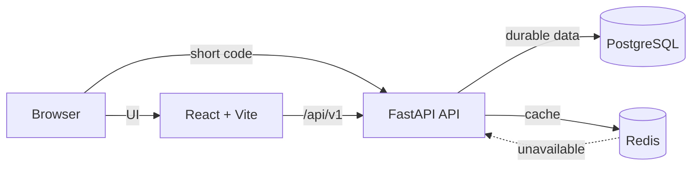

# Shortly

Shortly is a full-stack URL-management platform for dependable short links and privacy-conscious analytics. Visitors can shorten immediately; registered users gain persistent management, QR codes, and detailed insights.

## Highlights

- Anonymous shortening, custom aliases, titles, expirations, and lifecycle controls
- JWT access/refresh authentication with securely hashed passwords
- Searchable, filtered, paginated link management and QR codes
- Click trends plus referrer, browser, OS, device, and country breakdowns
- Redis-assisted redirects with transparent database fallback
- PostgreSQL production storage and SQLite local/test mode
- Responsive accessible React UI; Alembic, tests, Docker, and CI

## Architecture



FastAPI is a modular monolith: routes validate and authorize, services hold business rules, repositories isolate persistence, and SQLAlchemy models define durable state. Redis is an optimization, never a source of truth. Read [the architecture guide](docs/architecture.md) for flows and scaling tradeoffs.

## Stack and structure

Python 3.12+, FastAPI, Pydantic v2, SQLAlchemy 2, Alembic, PostgreSQL/SQLite, Redis, Pytest, Ruff, React 19, TypeScript, Vite, Tailwind, TanStack Query, Recharts, Vitest, Docker, and GitHub Actions.

```text
app/                 FastAPI modular monolith
  api/ core/ db/ models/ repositories/ schemas/ services/
alembic/              Database migrations
frontend/             React application and component tests
tests/                Backend API and service tests
docs/                 Architecture notes
.github/workflows/    Continuous integration
```

## Local setup

```bash
python -m venv .venv
# Windows: .venv\Scripts\activate
# macOS/Linux: source .venv/bin/activate
python -m pip install -e ".[dev]"
copy .env.example .env       # use `cp` on macOS/Linux
alembic upgrade head
uvicorn app.main:app --reload
```

In another terminal:

```bash
cd frontend
npm ci
npm run dev
```

Open `http://localhost:5173`; OpenAPI docs are at `http://localhost:8000/docs`.

## Docker

Set strong secrets, then start PostgreSQL, Redis, API, and frontend:

```bash
SECRET_KEY="$(openssl rand -hex 32)" ANALYTICS_SALT="$(openssl rand -hex 32)" docker compose up --build
```

On PowerShell set `$env:SECRET_KEY` and `$env:ANALYTICS_SALT` first.

## Configuration

| Variable | Purpose | Local default |
|---|---|---|
| `DATABASE_URL` | Async SQLAlchemy URL | SQLite file |
| `REDIS_URL` | Optional Redis endpoint | unset |
| `SECRET_KEY` | JWT signing secret | development-only value |
| `ANALYTICS_SALT` | Visitor-hash salt | development-only value |
| `PUBLIC_BASE_URL` | Generated link origin | `http://localhost:8000` |
| `FRONTEND_URL` | Client origin | `http://localhost:5173` |
| `CORS_ORIGINS` | Comma-separated allowed origins | frontend URL |
| `ACCESS_TOKEN_MINUTES` / `REFRESH_TOKEN_DAYS` | Token lifetimes | `15` / `7` |
| `TRUST_PROXY_HEADERS` | Honor forwarded IP headers | `false` |

Never commit `.env`. Production must use unique high-entropy secrets and HTTPS origins. Run `alembic upgrade head` for migrations.

## Verification

```bash
ruff check .
pytest
cd frontend
npm run lint
npm run typecheck
npm test
npm run build
```

CI runs these checks plus a clean migration. Tests use local SQLite and no external services. `/health` is liveness, `/ready` verifies the database, the versioned API is `/api/v1`, and public redirects are `GET /{short_code}`.

## Security and privacy

Only HTTP(S) destinations pass validation. Reserved aliases are blocked, generated codes use `secrets`, and database uniqueness handles concurrency. Ownership checks return 404 to avoid resource disclosure. Passwords are stored as adaptive hashes. Request sizes, CORS, inputs, and abuse rates are bounded.

Raw IP addresses are never stored. The visitor ID hashes a secret salt, UTC date, and address so it rotates daily. Country is only a coarse two-letter value from explicitly trusted infrastructure. Proxy headers are ignored by default. JWT logout discards client tokens; production environments with stricter threats should add refresh-token rotation/revocation.

## Scaling and tradeoffs

Redis cache-aside redirects fall back to indexed database lookups and mutation invalidates cache keys, allowing stateless API replicas. Analytics is transactional for simple, reliable behavior. At sustained volume it should move to a bounded queue with idempotent consumers and batch inserts. Later steps are event-table partitioning, scheduled rollups, read replicas, regional caches, and edge abuse controls—not premature dependencies.

The fallback limiter is process-local, so multi-instance production should use Redis atomic counters or an edge gateway. SQLite optimizes onboarding; PostgreSQL is the production concurrency target.

## Deployment

`render.yaml` is an API/PostgreSQL starting point. Configure `PUBLIC_BASE_URL`, `CORS_ORIGINS`, strong secrets, and optional managed Redis; build the frontend with `VITE_API_URL` and deploy it as a container or static site. Apply migrations during release/startup and configure DNS/TLS.

## Screenshots and future work

No fabricated screenshots are committed. Run the app and capture desktop/mobile home, populated dashboard, links, and analytics views into `docs/screenshots/`. Future work includes refresh-token rotation, email recovery, asynchronous analytics, bot filtering, teams, custom domains, and aggregate rollups.

## License

No open-source license is granted because repository ownership/licensing intent was not specified. The owner should add their chosen license before inviting reuse.
